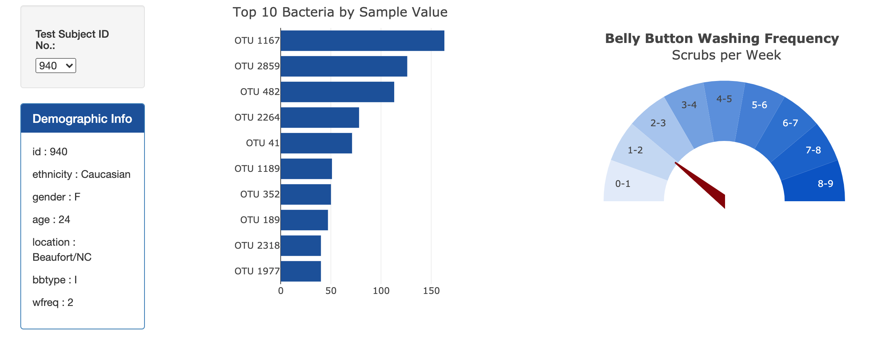
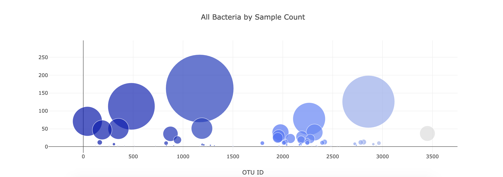

# Belly Button Bacteria

The objective of this project was to create an interactive website that displays clear visualizations of the bacteria in each subject's belly button.

When the user selects a subject from the dropdown d3.js detects the change and filters the data to create the graphs in plotly.

To view the functioning site go to:
 https://carlykelly.github.io/Belly_Button_Bacteria/

 
 